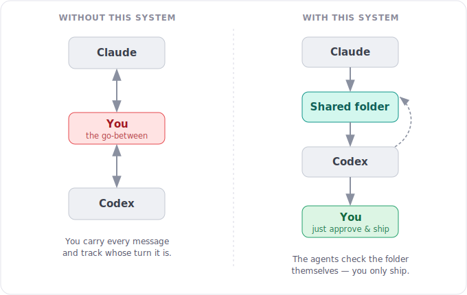
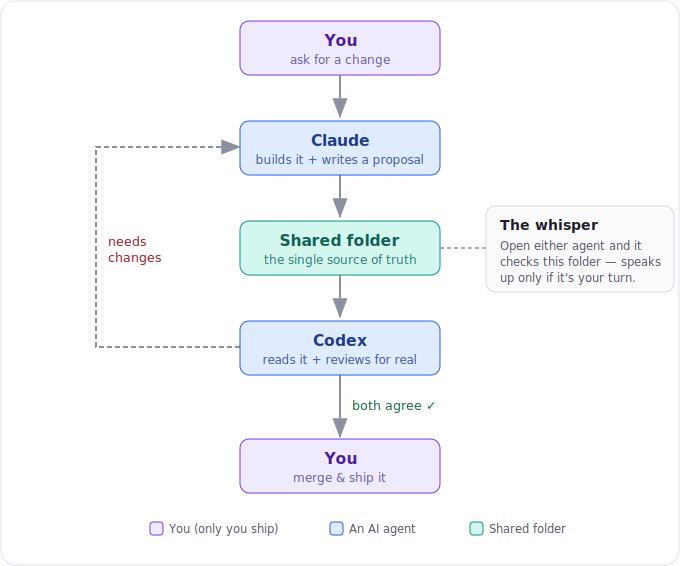

# The problem, and why this is files instead of n8n or Zapier

## The problem

You want two AI agents to check each other's work before anything ships — because an agent reviewing its own work has a blind spot: the same reasoning that produced a mistake tends to miss it. A second, independent agent catches what the first cannot.

But the naive way to run two agents turns **you** into the bottleneck. You paste the first agent's output into the second, relay the review back, re-explain the rules every session, and try to remember whose turn it is. The review is valuable; the babysitting is not.

## The approach

Three moving parts, no server:

1. **A shared folder of markdown files.** Every change gets a proposal file — what changed, why, where the work lives. Reviews, revisions, and sign-offs are appended to the same file. It is the entire paper trail.
2. **A silent "whisper" per agent.** A tiny script each agent runs at session start. It reads the folder, works out whose turn it is, and stays completely silent unless something is waiting on *that* agent — then it prints one line. You never relay status again.
3. **You, at one gate.** You run one agent at a time and you perform the final act — merge, publish, send. Two AIs agreeing is not enough to ship; a human decides.

## Why not run this through n8n or Zapier?

n8n and Zapier are excellent — for the shape of problem they're built for: **gluing APIs together across apps.** "New Stripe payment → add a row to a sheet → send a WhatsApp." If that's your task, use them; we do.

Peer review between coding agents is a *different shape of problem*, and the workflow tools are the wrong fit for concrete reasons:

| | Files + whispers (this kit) | n8n / Zapier |
|---|---|---|
| **Who does the actual review?** | The agent reasons over the real diff. | The tool can't review — it can only shuttle data to an LLM node. You *still* need the agent; the tool just adds a layer in front of it. |
| **Where does state live?** | In your repo, next to the code, in git history — diffable, auditable, offline. | In their cloud. Your review trail lives in a vendor's database, not your version control. |
| **Infrastructure** | Shell scripts and text files. Nothing to host, patch, or secure. | A server to run (n8n) or a paid SaaS with rate limits (Zapier). A new thing that can break at 2am. |
| **Data boundary** | Your code and proposals never leave your machine. | Your work passes through a third-party orchestrator. |
| **The human gate** | Built in — the human ships, by design. | These tools pull toward *removing* the human ("trigger → auto-merge"). The gate becomes something you have to add back. |
| **Portability** | Markdown + bash. Any agent (Claude, Codex, Gemini), any repo. | Locked to the vendor's nodes and pricing. |
| **Cost** | Free. | Per-task pricing or hosting cost. |

The deeper point: **a workflow engine orchestrates *actions*. This problem is about *reasoning over shared state with a human gate*.** The state is text, it belongs in your repo, and the "trigger" is just an agent reading a folder when you open it. Wrapping that in a cloud automation platform adds cost, a failure surface, and a data-egress boundary — while doing none of the hard part, which is the review itself.

## When you *should* reach for n8n / Zapier instead

Be honest about the boundary. Use a workflow tool when the job is genuinely cross-app API plumbing with no reasoning and no human gate:

- Sync records between two SaaS apps on a schedule.
- Fan an incoming webhook out to Slack, email, and a spreadsheet.
- Move data through a fixed, deterministic pipeline of connectors.

Reach for this kit when the job is **two agents judging work, with a person making the final call.** Different shape, different tool.

---

*Part of the [ASO Dual-Agent Review Kit](../README.md) — the system [ASO Ltd.](https://www.asoltd.info) runs its own website changes through.*
